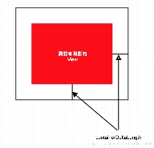
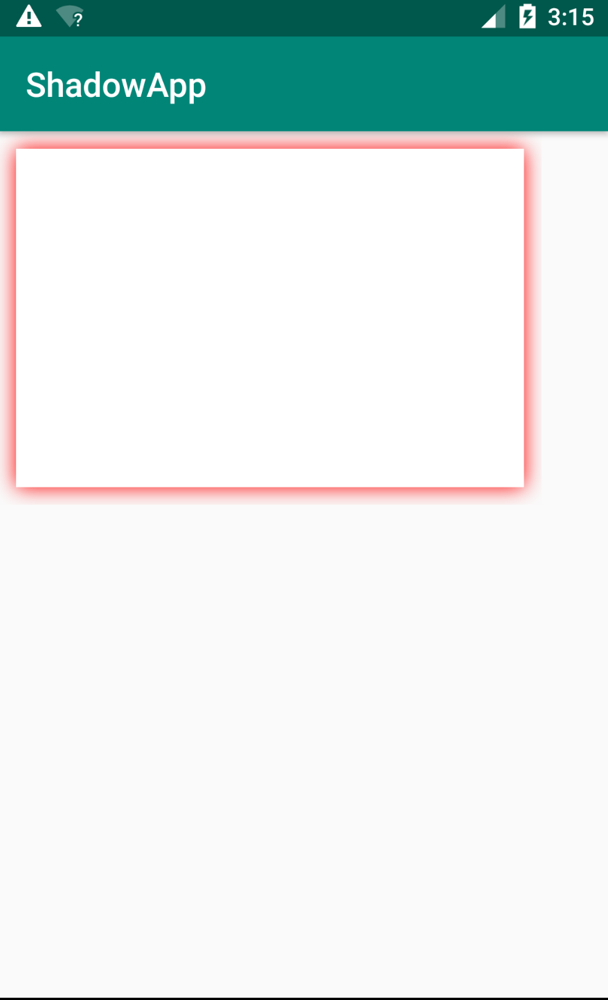

ShadowContainer属性介绍：
> containerShadowColor

阴影的颜色

> containerCornerRadius

阴影的圆角半径，和View的background圆角保持一致即可

> containerShadowRadius

阴影的模糊半径，值越大阴影越大

> containerDeltaLength

阴影展示的区域位置

> enable

是否展示阴影,通过修改enable可以实现阴影的显示与隐藏，达到类似于选择器的效果

> deltaX

x方向的偏移量

> deltaY

y方向的偏移量

示例代码

    <?xml version="1.0" encoding="utf-8"?>
    <LinearLayout xmlns:android="http://schemas.android.com/apk/res/android"
        xmlns:tools="http://schemas.android.com/tools"
        xmlns:app="http://schemas.android.com/apk/res-auto"
        android:layout_width="match_parent"
        android:layout_height="match_parent"
        tools:context=".MainActivity">
    
    
        <example.chenj.com.shadow.ShadowContainer
            android:layout_width="wrap_content"
            android:layout_height="wrap_content"
            app:containerDeltaLength="10dp"
            app:containerShadowRadius="10dp"
            app:containerShadowColor="#f00"
            app:enable="true"
            >
    
            <TextView
                android:layout_width="300dp"
                android:layout_height="200dp"
                android:background="#fff"
                />
        </example.chenj.com.shadow.ShadowContainer>
    </LinearLayout>
    
效果图：

